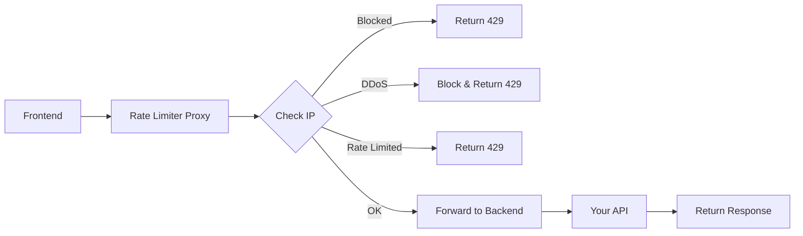

# 🛡️ Simple API Rate Limiter

A lightweight proxy service that adds rate limiting and DDoS protection to any backend API in under 5 minutes.

## 🚀 Quick Start

### 1. **One-Click Deploy**

[](https://render.com/deploy)

**Or manually:**

1. Fork this repository
2. Connect to your hosting platform (Render/Railway/Heroku)
3. Set environment variables (see below)
4. Deploy!

### 2. **Environment Variables**

Set these in your hosting platform:

```bash
BACKEND_URL=https://your-actual-backend.com
REQUESTS_PER_HOUR=60
DDOS_REQUESTS_PER_MINUTE=20
BLOCK_DURATION_MINUTES=60
```

### 3. **Update Your Frontend**

```javascript
// Before:
const API_URL = "https://your-backend.com"

// After:
const API_URL = "https://your-rate-limiter.onrender.com"
```

**That's it!** 🎉

## ⚡ Features

| Feature | Description | Benefit |
|---------|-------------|---------|
| **Rate Limiting** | 60 requests/hour per IP | Prevents abuse |
| **DDoS Protection** | Blocks 20+ requests/minute | Stops attacks |
| **Smart IP Detection** | Works with CDNs/proxies | Accurate blocking |
| **File Upload Support** | Handles multipart data | Works with images |
| **Auto-Unblocking** | IPs unblocked after 60min | Self-healing |
| **Request Logging** | All requests logged | Easy monitoring |

## 📊 Configuration Examples

### For Image APIs (like Deepfake Detection):
```bash
BACKEND_URL=https://your-ai-backend.com
REQUESTS_PER_HOUR=60          # Reasonable for AI processing
DDOS_REQUESTS_PER_MINUTE=15   # Conservative for heavy APIs
BLOCK_DURATION_MINUTES=60     # 1 hour block
```

### For Public APIs:
```bash
BACKEND_URL=https://your-public-api.com
REQUESTS_PER_HOUR=100         # Higher limit
DDOS_REQUESTS_PER_MINUTE=30   # More lenient
BLOCK_DURATION_MINUTES=30     # Shorter blocks
```

### For Development:
```bash
BACKEND_URL=http://localhost:5000
REQUESTS_PER_HOUR=200         # Very high limit
DDOS_REQUESTS_PER_MINUTE=50   # Lenient for testing
BLOCK_DURATION_MINUTES=10     # Quick unblock
```

## 📋 Monitoring

### Health Check
```bash
curl https://your-proxy.onrender.com/health
```

**Response:**
```json
{
  "status": "healthy",
  "active_ips": 15,
  "blocked_ips": 2,
  "total_requests": 1250,
  "successful_requests": 1180
}
```

### Detailed Statistics
```bash
curl https://your-proxy.onrender.com/stats
```

**Response:**
```json
{
  "blocked_ips": [
    {
      "ip": "192.168.1.100",
      "remaining_minutes": 45,
      "unblock_time": "2024-01-15 11:30:00"
    }
  ],
  "ip_usage": {
    "192.168.1.200": {
      "requests_this_hour": 35,
      "remaining_requests": 25
    }
  }
}
```

### Unblock IP (Admin)
```bash
curl https://your-proxy.onrender.com/unblock/192.168.1.100
```

## 📝 Request Logs

All requests are logged to `requests.log`:

```
2024-01-15 10:30:45 - IP:192.168.1.100 | POST /predict | SUCCESS | → Backend 200 | 15/60
2024-01-15 10:31:20 - IP:192.168.1.200 | POST /predict | DDOS_BLOCKED | DDoS detected
2024-01-15 10:32:10 - IP:192.168.1.300 | GET /health | RATE_LIMITED | 65/60
2024-01-15 10:33:00 - ✅ Unblocked IP: 192.168.1.200
```

## 🔧 How It Works



1. **IP Detection**: Extracts real IP from headers (X-Forwarded-For, etc.)
2. **Rate Check**: Counts requests per hour per IP
3. **DDoS Check**: Monitors requests per minute
4. **Auto-Block**: Blocks suspicious IPs for set duration
5. **Forward**: Passes valid requests to your backend
6. **Logging**: Records all activity for monitoring

## 🛠️ Supported Platforms

| Platform | Deploy Command | Notes |
|----------|----------------|-------|
| **Render** | Connect GitHub repo | Recommended, free tier |
| **Railway** | `railway up` | Fast deployment |
| **Heroku** | `git push heroku main` | Classic choice |
| **Fly.io** | `fly deploy` | Global edge network |
| **Digital Ocean** | App Platform | Easy setup |

## 🔒 Security Features

- ✅ **Rate Limiting**: Prevents API abuse
- ✅ **DDoS Protection**: Blocks flood attacks  
- ✅ **IP Blocking**: Automatic threat response
- ✅ **Request Logging**: Security audit trail
- ✅ **Header Forwarding**: Preserves client info
- ✅ **Error Handling**: Graceful failure responses

## 🚨 Error Responses

### Rate Limited:
```json
{
  "error": "Rate limit exceeded",
  "limit": "60 requests per hour",
  "current_count": 65,
  "reset_in_minutes": 45
}
```

### DDoS Blocked:
```json
{
  "error": "IP blocked due to suspicious activity",
  "reason": "DDoS detected",
  "block_duration_minutes": 60
}
```

### Backend Issues:
```json
{
  "error": "Backend service unavailable"
}
```

## 📊 Use Cases

### 🤖 **AI/ML APIs**
- Deepfake detection
- Image processing
- Text generation
- Computer vision

### 🌐 **Public APIs** 
- REST endpoints
- File uploads
- Data processing
- Third-party integrations

### 🔐 **Internal Services**
- Microservices protection
- Load balancing
- Request monitoring
- Access control

## ⚙️ Customization

### Environment Variables Reference:

| Variable | Default | Description | Example |
|----------|---------|-------------|---------|
| `BACKEND_URL` | **Required** | Your API URL | `https://api.example.com` |
| `REQUESTS_PER_HOUR` | `60` | Max requests per IP per hour | `100` |
| `DDOS_REQUESTS_PER_MINUTE` | `20` | Requests/min to trigger block | `30` |
| `BLOCK_DURATION_MINUTES` | `60` | How long to block IPs | `120` |
| `PORT` | `8080` | Server port (auto-set) | `5000` |

### File Structure:
```
api-rate-limiter/
├── app.py              # Main proxy service (287 lines)
├── requirements.txt    # Python dependencies
├── .env.example       # Configuration template
├── Procfile           # Deployment config
└── README.md          # This file
```

## 🤝 Contributing

1. Fork the repository
2. Create a feature branch
3. Make your changes
4. Test thoroughly
5. Submit a pull request

## 📄 License

MIT License - feel free to use in your projects!

## 🆘 Support

### Common Issues:

**Q: My requests are being blocked**
A: Check `/stats` endpoint to see your IP's usage

**Q: Backend not receiving requests**
A: Verify `BACKEND_URL` is correct and accessible

**Q: File uploads not working**  
A: Proxy automatically handles multipart/form-data

**Q: Getting 502 errors**
A: Your backend might be down or unreachable

## 🎯 Perfect For:

- ✅ Deepfake detection APIs
- ✅ Image processing services  
- ✅ AI/ML endpoints
- ✅ File upload APIs
- ✅ Public REST APIs
- ✅ Microservices protection
- ✅ Development/testing environments

---

**🚀 Deploy in under 5 minutes and protect your API from abuse!**

[](https://render.com/deploy)
